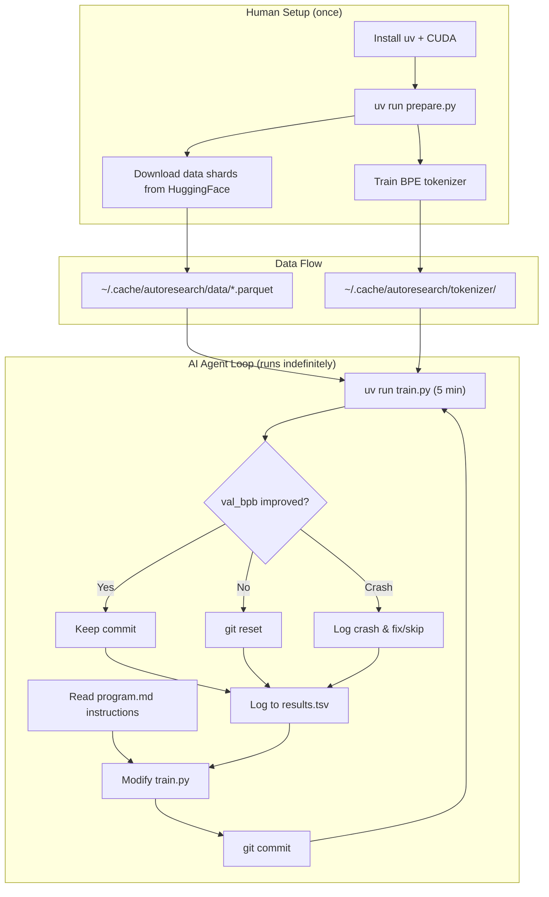
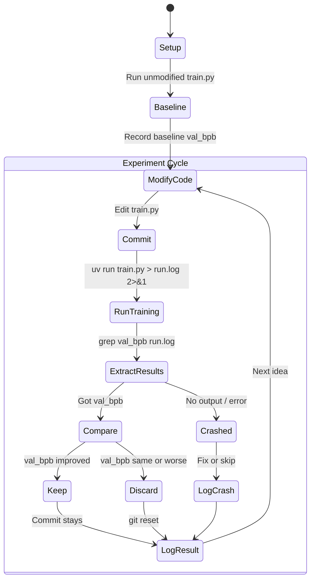
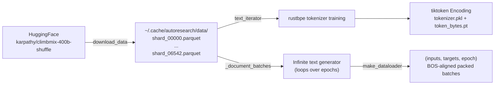
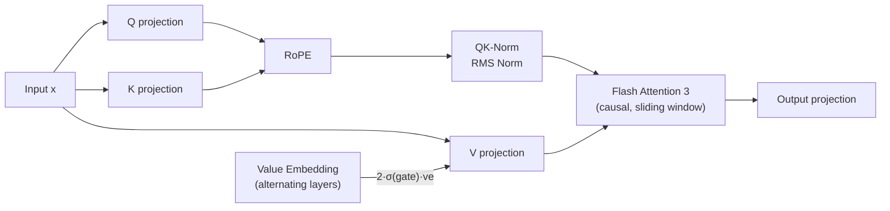
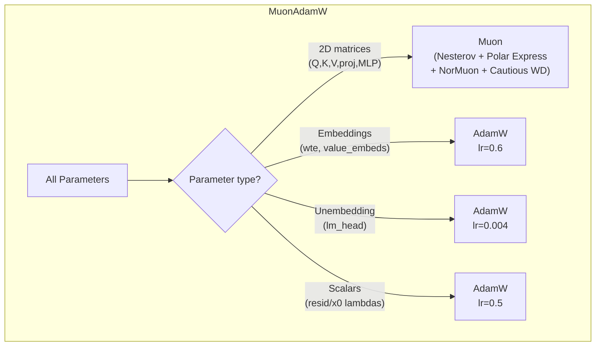
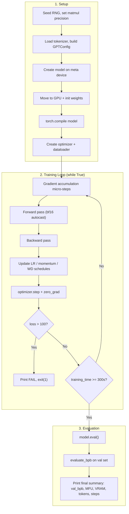

# autoresearch — Codebase Documentation

An autonomous AI research system by Andrej Karpathy. An AI agent modifies a GPT training script, runs 5-minute experiments, keeps improvements, discards regressions, and repeats — indefinitely, without human supervision.

---

## Table of Contents

1. [Repository Structure](#repository-structure)
2. [High-Level Architecture](#high-level-architecture)
3. [The Autonomous Experiment Loop](#the-autonomous-experiment-loop)
4. [prepare.py — Data & Evaluation Infrastructure](#preparepy--data--evaluation-infrastructure)
5. [train.py — Model, Optimizer & Training Loop](#trainpy--model-optimizer--training-loop)
6. [program.md — Agent Instructions](#programmd--agent-instructions)
7. [analysis.ipynb — Experiment Analysis](#analysisipynb--experiment-analysis)
8. [Key Design Decisions](#key-design-decisions)

---

## Repository Structure

```
autoresearch/
├── prepare.py          # Data download, tokenizer training, dataloader, eval metric (READ-ONLY)
├── train.py            # GPT model + optimizer + training loop (EDITED BY AI AGENT)
├── program.md          # Instructions for the AI agent
├── analysis.ipynb      # Jupyter notebook for visualizing experiment results
├── pyproject.toml      # Python dependencies (torch 2.9.1, kernels, tiktoken, etc.)
├── .python-version     # Python 3.10
├── uv.lock             # Dependency lockfile
├── progress.png        # Generated chart showing experiment progress
└── README.md           # Project overview
```

**No subdirectories.** The entire project lives in a single flat directory by design.

**Runtime artifacts** (gitignored):
- `~/.cache/autoresearch/data/` — downloaded parquet data shards
- `~/.cache/autoresearch/tokenizer/` — trained tokenizer files
- `results.tsv` — experiment log (created by the agent)
- `run.log` — stdout/stderr of the latest training run

---

## High-Level Architecture



---

## The Autonomous Experiment Loop

The system is designed around a single core idea: an AI agent runs an infinite loop of hypothesis → experiment → evaluate → keep/discard.



**Throughput:** ~12 experiments/hour, ~100 experiments per overnight sleep cycle.

**Results tracking** (`results.tsv`):

| Column | Example | Notes |
|---|---|---|
| `commit` | `a1b2c3d` | 7-char short hash |
| `val_bpb` | `0.993200` | Lower is better. `0.000000` for crashes |
| `memory_gb` | `44.2` | Peak VRAM in GB. `0.0` for crashes |
| `status` | `keep` / `discard` / `crash` | Outcome |
| `description` | `increase LR to 0.04` | What was tried |

---

## prepare.py — Data & Evaluation Infrastructure

This file serves two roles: a one-time CLI script for data preparation, and an importable module providing runtime utilities to `train.py`. It is **read-only** — the AI agent must never modify it.

### Constants

| Constant | Value | Purpose |
|---|---|---|
| `MAX_SEQ_LEN` | `2048` | Context window length |
| `TIME_BUDGET` | `300` | Training time limit (5 minutes) |
| `EVAL_TOKENS` | `40 × 524288` (~21M) | Tokens evaluated for val_bpb |
| `VOCAB_SIZE` | `8192` | BPE vocabulary size (including 4 special tokens) |
| `MAX_SHARD` / `VAL_SHARD` | `6542` | Last shard = pinned validation shard |

### Data Pipeline



**Download** (`download_data`): Fetches parquet shards in parallel (configurable workers). Retries up to 5 times with exponential backoff. The validation shard (`shard_06542`) is always included.

**Tokenizer Training** (`train_tokenizer`):
1. Reads up to 1B characters from training shards
2. Trains BPE with `rustbpe` (8188 merges + 4 special tokens = 8192 vocab)
3. Uses GPT-4's split pattern (with 2-digit number grouping instead of 3)
4. Wraps the result in a `tiktoken.Encoding`, pickles it
5. Pre-computes `token_bytes.pt` — UTF-8 byte length per token (needed for BPB metric)

### Dataloader (`make_dataloader`)

A generator that yields `(inputs, targets, epoch)` tensors with **100% token utilization** (no padding).

The packing strategy:
1. Maintains a buffer of tokenized documents (each prepended with BOS)
2. For each row in the batch: greedily fills with the **largest fitting document** (best-fit bin packing)
3. If no document fits the remaining space: takes the **shortest document** and crops it to fill exactly
4. Splits each packed row into input (all but last token) and target (all but first token)
5. Uses pinned CPU memory + async GPU transfer for throughput

### Evaluation (`evaluate_bpb`)

The fixed, immutable evaluation metric.

- **Bits per byte (BPB)**: vocabulary-size-independent metric. Computed as `total_nats / (ln(2) × total_bytes)`.
- Runs model on the validation shard with `reduction='none'` to get per-token losses.
- Looks up the UTF-8 byte length of each target token via `token_bytes.pt`.
- Special tokens (byte length 0) are excluded from both numerator and denominator.
- Evaluates on exactly `EVAL_TOKENS` (~21M tokens).

### Tokenizer Class

Wraps `tiktoken.Encoding` with convenience methods:
- `from_directory()` — loads the pickled tokenizer
- `encode(text, prepend=BOS)` — encodes single strings or batches (multi-threaded)
- `decode(ids)` — decodes back to text
- `get_vocab_size()` / `get_bos_token_id()`

---

## train.py — Model, Optimizer & Training Loop

This is the **only file the AI agent modifies**. It contains the complete model definition, optimizer, and training loop — everything needed for a 5-minute training run.

### Model Architecture (GPT class)

```mermaid
graph TB
    subgraph "GPT Forward Pass"
        A["Token IDs [B, T]"] --> B["Token Embedding (wte)"]
        B --> C["RMS Norm"]
        C --> D["x₀ = x (save for skip connections)"]

        D --> E["Layer 0"]
        E --> F["Layer 1"]
        F --> G["..."]
        G --> H["Layer N-1"]

        H --> I["RMS Norm"]
        I --> J["lm_head (Linear → vocab)"]
        J --> K["Logit Soft-Cap (15 × tanh(logits/15))"]
        K --> L["Cross-Entropy Loss"]
    end

    subgraph "Each Layer (Block)"
        M["Residual Scaling:<br/>x = λ_resid[i]·x + λ_x0[i]·x₀"] --> N["RMS Norm → Attention → Add"]
        N --> O["RMS Norm → MLP → Add"]
    end
```



**Default configuration:**

| Parameter | Default | Notes |
|---|---|---|
| `DEPTH` | `8` | Number of transformer layers |
| `ASPECT_RATIO` | `64` | `model_dim = depth × aspect_ratio`, rounded up to `HEAD_DIM` |
| `HEAD_DIM` | `128` | Per-head dimension |
| `model_dim` | `512` | Derived: `ceil(8×64 / 128) × 128` |
| `num_heads` | `4` | Derived: `512 / 128` |
| `WINDOW_PATTERN` | `"SSSL"` | Sliding window attention pattern |

#### Attention (`CausalSelfAttention`)



Key features:
- **Sliding Window Attention**: Pattern `"SSSL"` means layers cycle through Short-Short-Short-Long windows. Short = `seq_len/2`, Long = `seq_len`. The last layer is always Long.
- **Value Embeddings (ResFormer)**: Alternating layers have a separate `nn.Embedding` for values, mixed in via an input-dependent sigmoid gate. Gate reads only the first 32 channels of the input, outputs per-head mixing weights. Initialized neutral (gate bias = 0 → sigmoid = 0.5 → scale 2×0.5 = 1.0).
- **RoPE**: Standard rotary embeddings (base 10000) applied to Q and K.
- **QK-Norm**: Both Q and K are RMS-normalized after RoPE application.
- **Flash Attention 3**: Uses `kernels` package — auto-selects Hopper-optimized FA3 on SM90 GPUs, community kernels otherwise.

#### MLP

Two linear layers with **Squared ReLU** activation: `x → Linear(d→4d) → ReLU² → Linear(4d→d)`.

#### Special Architectural Features

- **Residual lambdas + x₀ lambdas**: Per-layer learnable scalars. Before each block: `x = resid_lambda[i] * x + x0_lambda[i] * x₀`. Provides a direct skip connection from the initial embedding (`x₀`) to every layer. Init: `resid_lambda=1.0`, `x0_lambda=0.1`.
- **Logit soft-capping**: `15 × tanh(logits / 15)` — prevents logit magnitudes from growing unbounded.
- **Weight initialization**: Embeddings ∼ N(0,1); lm_head ∼ N(0,0.001); Q/K/V ∼ Uniform(-√(3/d), √(3/d)); output projections = 0; `resid_lambdas` = 1.0; `x0_lambdas` = 0.1.

### Optimizer (MuonAdamW)

A hybrid optimizer that uses two different algorithms depending on the parameter type:



#### Muon Algorithm (for matrix parameters)

The Muon update for 2D weight matrices:

1. **Nesterov Momentum**: `buf.lerp_(grad, 1-μ)`, then `g = grad.lerp_(buf, μ)`. Momentum ramps from 0.85 → 0.95 over the first 300 steps.
2. **Polar Express**: Newton-Schulz iteration (5 steps) to approximate the matrix polar factor — orthogonalizes the update direction. Uses pre-computed polynomial coefficients.
3. **NorMuon Variance Reduction**: Per-dimension second-moment EMA (β₂=0.95) to normalize gradient variance.
4. **Cautious Weight Decay**: Weight decay only applied where `grad × param ≥ 0` (sign agreement). Decays linearly to 0 over training.

All optimizer kernels are `@torch.compile(dynamic=False, fullgraph=True)` for maximum performance. Hyperparameters are stored as 0-D CPU tensors to avoid triggering recompilation when values change (e.g., during LR schedule updates).

#### Learning Rate Schedule

```
|← warmup →|←── constant ──→|←──── warmdown ────→|
   (0%)          (50%)              (50%)
 LR: 0→1       LR: 1            LR: 1→0
```

With defaults: `WARMUP_RATIO=0.0` (no warmup), `WARMDOWN_RATIO=0.5` (linear decay over the last 50% of training to `FINAL_LR_FRAC=0.0`).

All LRs are scaled by `(model_dim / 768)^-0.5` to adjust for model size.

### Training Loop



Key details:
- **Time-based training**: Runs for exactly `TIME_BUDGET=300` seconds (5 minutes) of wall-clock training time, excluding the first 10 steps (compilation warmup).
- **Gradient accumulation**: `TOTAL_BATCH_SIZE / (DEVICE_BATCH_SIZE × MAX_SEQ_LEN)` micro-steps per optimizer step.
- **Precision**: bf16 autocast for forward/backward, float32 logits for loss computation.
- **GC management**: Python garbage collector is disabled after step 0 (to avoid 500ms stalls), with periodic `gc.collect()` every 5000 steps.
- **Fast-fail**: If training loss exceeds 100, prints `"FAIL"` and exits with code 1.
- **MFU tracking**: Model FLOP utilization computed against H100 peak BF16 FLOPS (989.5 TFLOPS).

### Hyperparameter Summary

| Parameter | Value | Used by |
|---|---|---|
| `TOTAL_BATCH_SIZE` | 2¹⁹ (524,288 tokens) | Training loop |
| `DEVICE_BATCH_SIZE` | 128 | Training loop |
| `MATRIX_LR` | 0.04 | Muon optimizer |
| `EMBEDDING_LR` | 0.6 | AdamW (wte, value embeds) |
| `UNEMBEDDING_LR` | 0.004 | AdamW (lm_head) |
| `SCALAR_LR` | 0.5 | AdamW (lambdas) |
| `WEIGHT_DECAY` | 0.2 | Muon (cautious, decays to 0) |
| `ADAM_BETAS` | (0.8, 0.95) | AdamW |
| `WARMUP_RATIO` | 0.0 | LR schedule |
| `WARMDOWN_RATIO` | 0.5 | LR schedule |
| `DEPTH` | 8 | Model |
| `ASPECT_RATIO` | 64 | Model (dim = depth × ratio) |

---

## program.md — Agent Instructions

This is the "program" that drives the AI agent. Key rules:

1. **Only `train.py` is editable.** `prepare.py` is read-only. No new dependencies allowed.
2. **Goal: minimize `val_bpb`.** Lower is better. VRAM increases are acceptable for meaningful gains.
3. **Simplicity matters.** Small improvements that add ugly complexity may not be worth keeping. Deletions that maintain performance are always wins.
4. **Never stop.** The agent runs indefinitely. No asking for human permission. If out of ideas, think harder — re-read code, try combinations, attempt radical changes.
5. **10-minute kill threshold.** If a run exceeds 10 minutes, kill it and log as crash.
6. **Branch model.** Each session creates a branch `autoresearch/<tag>`. The branch advances only on improvements; regressions are reset.

---

## analysis.ipynb — Experiment Analysis

Jupyter notebook that reads `results.tsv` and produces:

1. **Status breakdown**: Count of keep/discard/crash experiments and keep rate
2. **Progress chart** (`progress.png`): Scatter plot of all experiments. Green = kept, gray = discarded. Running minimum line shows the improvement frontier. Each kept experiment is annotated with its description.
3. **Summary statistics**: Baseline val_bpb, best achieved, total improvement (absolute + percentage)
4. **Ranked improvements**: Each kept experiment's delta over the previous best, sorted by contribution size

---

## Key Design Decisions

| Decision | Rationale |
|---|---|
| **Single flat directory** | Minimizes complexity for the AI agent. No navigating project structure. |
| **One editable file** | Constrains the search space. The agent focuses on what matters: model architecture, optimizer, hyperparameters. |
| **Fixed 5-minute time budget** | Enables rapid iteration. ~12 experiments/hour. Long enough to see signal, short enough for high throughput. |
| **BPB over perplexity** | Bits-per-byte is vocabulary-size-independent. The agent can change vocab size without breaking the metric. |
| **Read-only evaluation** | Prevents the agent from gaming the metric. `evaluate_bpb` in `prepare.py` is the ground truth. |
| **Git-based experiment tracking** | Clean history of what worked. Branch advances only on improvement. Failed experiments are reverted. |
| **TSV over CSV** | Descriptions can contain commas. Tabs are safer delimiters. |
| **torch.compile everything** | Model and optimizer kernels are compiled for maximum throughput. 0-D CPU tensors for hyperparameters avoid recompilation. |
| **No padding in dataloader** | 100% token utilization via best-fit packing. Every compute cycle counts in a 5-minute budget. |
| **Time-based, not step-based** | Training ends after 300 wall-clock seconds regardless of model size or batch size. The agent can change architecture freely without adjusting step counts. |
